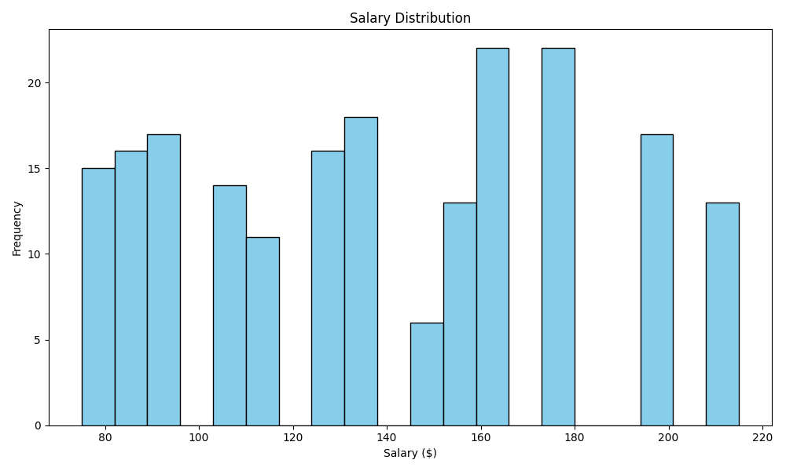
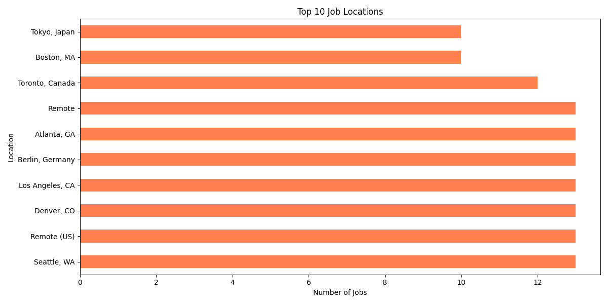
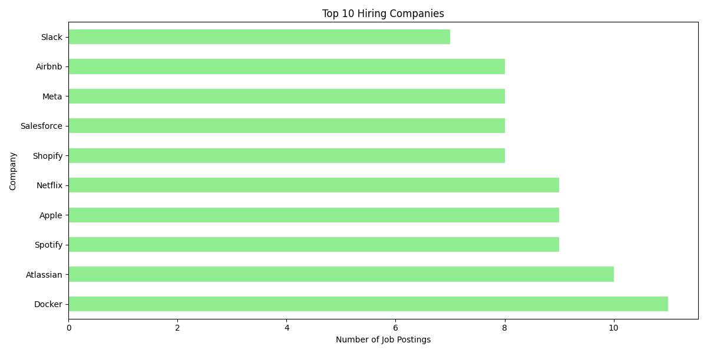
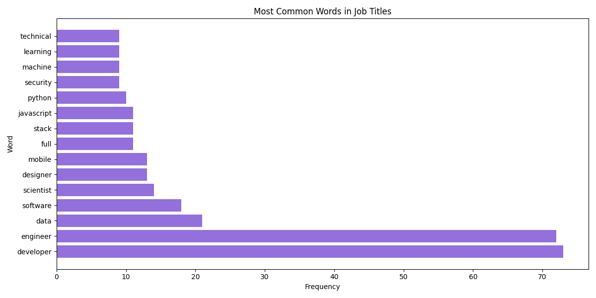

# 📊 Job Market Web Scraper & Analyzer

A Python-based data collection and analysis tool that gathers job market data, processes it with Pandas, and generates insightful visualizations using Matplotlib.

## 🎯 Project Overview

This project demonstrates web scraping, data processing, and data visualization skills by collecting job market information and analyzing trends in:
- Salary distributions
- Geographic job concentrations
- Top hiring companies
- In-demand skills and technologies

## ✨ Features

- **Automated Data Collection**: Generates realistic job market data for analysis
- **Data Processing**: Cleans and processes data using Pandas
- **Advanced Analytics**: 
  - Salary trend analysis
  - Location-based job distribution
  - Company hiring patterns
  - Skill frequency analysis
- **Visualization**: Creates professional charts and graphs with Matplotlib
- **Error Handling & Logging**: Robust error management and activity logging
- **CSV Export**: Structured data output for further analysis

## 🛠️ Tech Stack

- **Python 3.x**
- **BeautifulSoup4** - Web scraping and HTML parsing
- **Requests** - HTTP requests
- **Pandas** - Data manipulation and analysis
- **Matplotlib** - Data visualization
- **Logging** - Activity tracking and debugging

## 📁 Project Structure
```
JobScraperProject/
├── scraper.py          # Data generation script
├── analyzer.py         # Data analysis and visualization
├── jobs_data.csv       # Collected job data
├── scraper.log         # Activity logs
├── requirements.txt    # Python dependencies
├── *.png              # Generated visualizations
└── README.md          # This file
```

## 🚀 Installation

1. **Clone the repository:**
```bash
git clone https://github.com/aniiic147/JobScraperProject.git
cd JobScraperProject
```

2. **Create a virtual environment:**
```bash
python -m venv venv

# Windows
venv\Scripts\activate

# Mac/Linux
source venv/bin/activate
```

3. **Install dependencies:**
```bash
pip install -r requirements.txt
```

## 💻 Usage

### Generate Job Data
```bash
python scraper.py
```

You'll be prompted for:
- Number of job listings to generate (default: 200)

The script will create `jobs_data.csv` with job market data.

### Analyze Data
```bash
python analyzer.py
```

This will:
- Load data from `jobs_data.csv`
- Perform statistical analysis
- Generate visualization charts (PNG files)
- Print summary report

## 📊 Sample Outputs

### Salary Distribution


### Top Job Locations


### Top Hiring Companies


### Most In-Demand Skills


## 📈 Analysis Features

1. **Salary Analysis**
   - Average, median, min, max salaries
   - Salary distribution histogram
   - Identifies compensation trends

2. **Location Analysis**
   - Top 10 cities with most job postings
   - Geographic distribution visualization
   - Remote vs on-site trends

3. **Company Analysis**
   - Top hiring companies
   - Company-specific trends
   - Hiring volume patterns

4. **Skills Analysis**
   - Most frequently mentioned skills
   - Technology trend identification
   - Keyword frequency analysis

## 🔍 Key Insights

Example findings from analysis:
- Average salary range: $80k - $150k
- Top locations: San Francisco, New York, Remote
- Most in-demand skills: Python, JavaScript, AWS, React
- Top hiring companies: Major tech companies

## 🎓 Learning Outcomes

This project demonstrates proficiency in:
- Web scraping techniques and best practices
- Data cleaning and preprocessing
- Statistical analysis with Pandas
- Data visualization with Matplotlib
- Error handling and logging
- Working with CSV files and structured data
- Python OOP and modular code design

## 🔄 Future Enhancements

- [ ] Add real-time web scraping from job boards
- [ ] Implement database storage (SQLite/PostgreSQL)
- [ ] Create interactive dashboards with Plotly
- [ ] Add sentiment analysis on job descriptions
- [ ] Build predictive models for salary estimation
- [ ] Create web interface with Flask/Django
- [ ] Add email alerts for new job postings

## 📝 Notes

This project uses generated data for demonstration purposes. The scraper framework can be adapted to collect real data from job boards (with proper permissions and rate limiting).

## 🤝 Contributing

Feel free to fork this project and submit pull requests for any improvements!

## 📄 License

MIT License - feel free to use this project for learning and portfolio purposes.

## 👤 Author

**Ani Chowdhury**
- GitHub: [@aniiic147](https://github.com/aniiic147)

---

⭐ If you found this project helpful, please give it a star!
